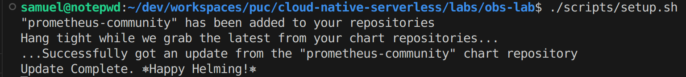
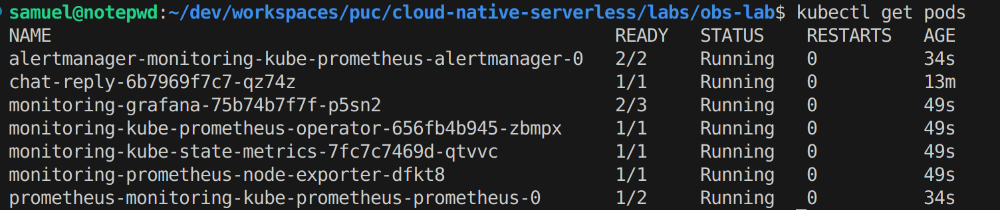
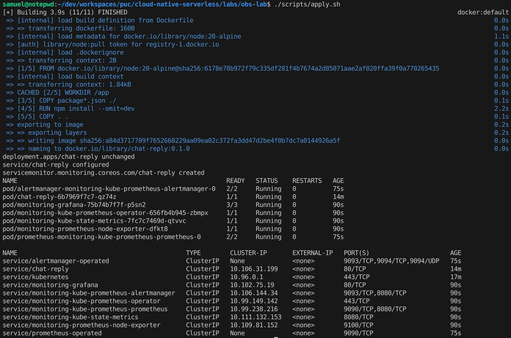
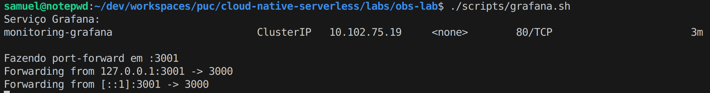
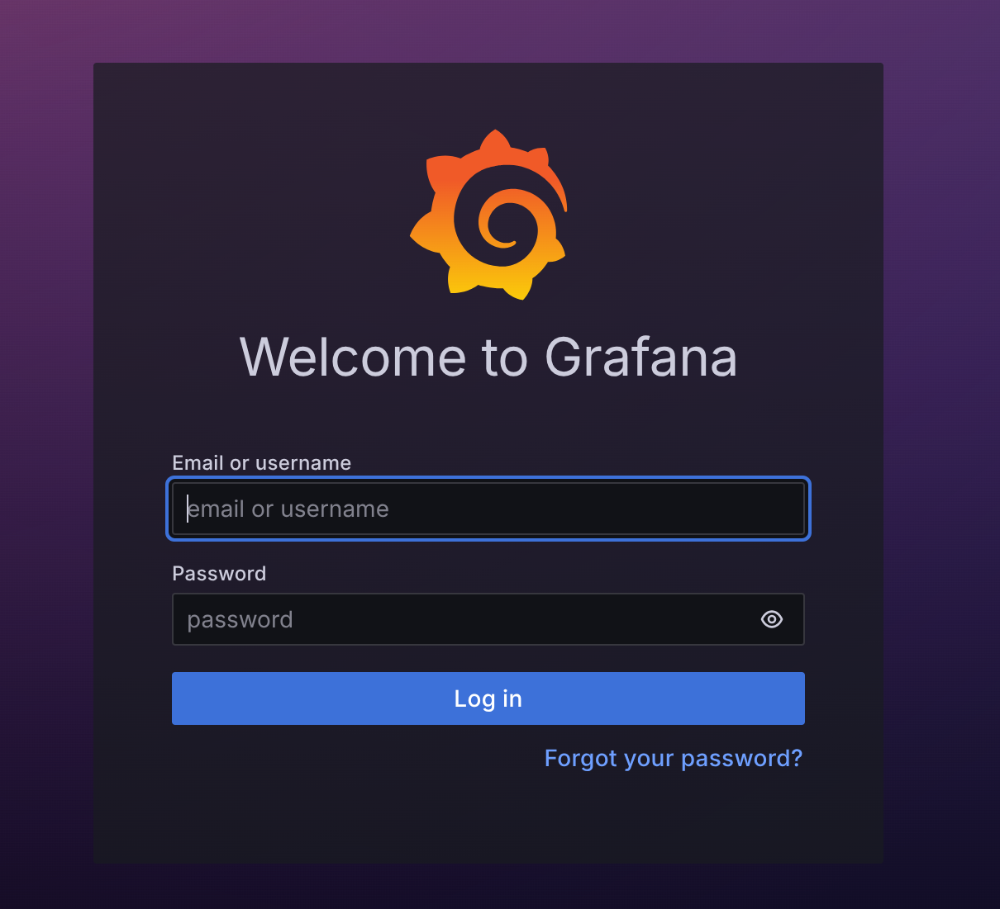
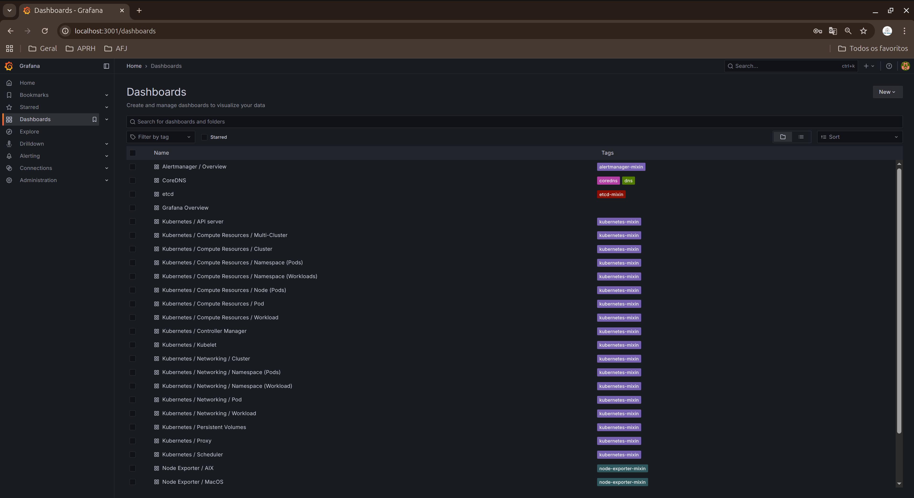

# OBS Lab — Observabilidade com Prometheus & Grafana no Kubernetes (Minikube)

Este workshop adiciona **observabilidade** à aplicação `chat-reply` em um cluster local (**Minikube**), expondo métricas em **Prometheus** e visualizando no **Grafana** via o chart **kube-prometheus-stack** (Helm).

---

## O que você vai construir

- App Node.js com endpoints:
  - `GET /metrics` (formato Prometheus, via `prom-client`)
  - `GET /healthz` e `GET /readyz`
  - `POST /reply` (endpoint funcional)
- Deploy em Kubernetes: `Deployment`, `Service`, `ServiceMonitor` (Prometheus Operator)
- Stack de observabilidade: **Prometheus + Alertmanager + Grafana** (Helm)

---

## Pré-requisitos (instale o que faltar)

> Você **não** precisa de cluster remoto. Usaremos **Minikube** local. Se já rodou o workshop anterior (WS2), provavelmente já tem quase tudo.

### 1) Docker (traz o Docker Compose v2)
**Linux (atalho oficial):**
```bash
curl -fsSL https://get.docker.com | sh
sudo usermod -aG docker "$USER"
# faça logoff/login ou: newgrp docker
docker --version
docker compose version
```
**macOS/Windows:** instale o **Docker Desktop** (inclui Compose v2).

### 2) kubectl
- **Ubuntu/Debian:**
```bash
sudo apt-get update && sudo apt-get install -y kubectl
```
- **macOS (Homebrew):**
```bash
brew install kubectl
```
- **Windows (Chocolatey):**
```powershell
choco install kubernetes-cli -y
```

### 3) Minikube
- **Linux:**
```bash
curl -LO https://storage.googleapis.com/minikube/releases/latest/minikube-linux-amd64
sudo install minikube-linux-amd64 /usr/local/bin/minikube
```
- **macOS (Homebrew):**
```bash
brew install minikube
```
- **Windows (Chocolatey):**
```powershell
choco install minikube -y
```

### 4) Helm 3
- **Linux (one-liner oficial):**
```bash
curl -fsSL https://raw.githubusercontent.com/helm/helm/main/scripts/get-helm-3 | bash
```
- **macOS (Homebrew):**
```bash
brew install helm
```
- **Windows (Chocolatey):**
```powershell
choco install kubernetes-helm -y
```

### 5) Utilitários usados
- `jq` (para alguns scripts e testes):
```bash
sudo apt-get install -y jq   # Ubuntu/Debian
```

> Confirme as versões básicas:
```bash
kubectl version --client
minikube version
helm version
docker --version
```

---

## Estrutura do projeto

```
obs-lab/
├─ app/                 # Node.js com métricas Prometheus
│  ├─ Dockerfile
│  ├─ package.json
│  └─ server.js
├─ k8s/
│  ├─ deployment.yaml
│  ├─ service.yaml
│  ├─ servicemonitor.yaml
│  └─ ingress.yaml      # opcional
└─ scripts/
   ├─ setup.sh          # instala kube-prometheus-stack (Helm)
   ├─ apply.sh          # build da imagem + apply dos manifests
   ├─ grafana.sh        # port-forward do Grafana (localhost:3001)
   └─ logs.sh           # logs/describe da app
```

---

## Imagens (resultado esperado)

| Etapa | Screenshot |
|------:|:-----------|
| 1. Setup da stack de observabilidade |  |
| 2. Conferindo pods |  |
| 3. Apply dos manifests da app |  |
| 4. Grafana acessível |  |
| 5. Login no Grafana |  |
| 6. Métricas no Grafana |  |

---

## Passo a passo

### 0) Permitir execução dos scripts (necessário uma vez)
```bash
chmod +x scripts/*.sh
```

### 1) Subir/confirmar o cluster e (opcional) habilitar o Ingress
```bash
minikube start
minikube addons enable ingress   # opcional, só se for usar o ingress.yaml
```

### 2) Instalar o stack de observabilidade (Helm)
```bash
cd obs-lab
./scripts/setup.sh
```
O script adiciona o repositório `prometheus-community`, atualiza e instala o **kube-prometheus-stack** (Prometheus, Alertmanager e Grafana). Aguarde os pods ficarem `Running`:
```bash
kubectl get pods -A | grep -E 'monitoring|grafana|prometheus|alertmanager'
```

### 3) Build e deploy da app (com ServiceMonitor)
```bash
./scripts/apply.sh
```
Este script:
- Faz build da imagem `chat-reply:0.1.0` a partir de `app/` e executa `minikube image load`;
- Aplica `Deployment`, `Service` (porta nomeada `http`) e `ServiceMonitor` (seleciona `app: chat-reply`);
- (Opcional) você pode aplicar o `ingress.yaml` — a linha está comentada no script.

> ⚠️ Se aparecer erro “**ServiceMonitor** CRD não encontrado”, rode o `./scripts/setup.sh` e repita o `./scripts/apply.sh`.

### 4) Abrir o Grafana (port-forward)
```bash
./scripts/grafana.sh
```
- Faz port-forward do serviço **Grafana** para `http://localhost:3001`.
- Para obter credenciais (se necessário):
```bash
# usuário
kubectl -n monitoring get secret -l app.kubernetes.io/name=grafana -o jsonpath='{.items[0].data.admin-user}' | base64 -d; echo
# senha
kubectl -n monitoring get secret -l app.kubernetes.io/name=grafana -o jsonpath='{.items[0].data.admin-password}' | base64 -d; echo
```

### 5) Gerar tráfego e ver métricas
Envie algumas requisições ao endpoint funcional e depois explore no Grafana:
```bash
# exemplo sem ingress, usando o ClusterIP via port-forward da app (opcional)
kubectl port-forward deploy/chat-reply 3000:3000 &
curl -s -X POST http://localhost:3000/reply -H 'content-type: application/json' \
  -d '{"messages":[{"role":"user","content":"olá"}]}' | jq .
# métricas cruas (Prometheus)
curl -s http://localhost:3000/metrics | head
```
No Grafana/Prometheus, procure por:
- `http_requests_total{route="/reply"}`
- `rate(http_requests_total[1m])`

### 6) (Opcional) Usar Ingress para acessar `/reply` por host
```bash
# aplique o ingress (ou descomente no apply.sh)
kubectl apply -f k8s/ingress.yaml

# adicione no /etc/hosts o IP do Minikube (se não fez no WS anterior)
MINIKUBE_IP=$(minikube ip)
echo "$MINIKUBE_IP  chat.local" | sudo tee -a /etc/hosts

# teste
curl -s -X POST http://chat.local/reply -H 'content-type: application/json' \
  -d '{"messages":[{"role":"user","content":"olá"}]}' | jq .
```

---

## Troubleshooting

- **CRD `servicemonitors.monitoring.coreos.com` ausente**
  - Rode `./scripts/setup.sh` antes do `./scripts/apply.sh`.
  - Verifique: `kubectl get crd servicemonitors.monitoring.coreos.com`

- **Sem séries na consulta**
  - Confirme seletores/labels: `Service` com `labels: { app: chat-reply }` e porta **nomeada** `http` (bate com `ServiceMonitor`).
  - Veja se o pod está pronto: `kubectl get pods` e `kubectl describe pod <nome>`

- **Grafana não abre**
  - Deixe o `./scripts/grafana.sh` rodando (port-forward ativo).
  - Verifique o namespace/serviço correto.

- **Imagem não encontrada pelo kubelet**
  - Rode novamente o build e o `minikube image load` (o `apply.sh` já faz). Confirme com:
  ```bash
  minikube image ls | grep chat-reply
  ```

- **Ver logs da app**
  ```bash
  ./scripts/logs.sh
  ```

---

## Limpeza
```bash
# remover a app
kubectl delete -f k8s --ignore-not-found

# opcional: remover a stack de observabilidade
helm -n monitoring uninstall monitoring || true
kubectl delete ns monitoring || true

# encerrar o cluster
minikube delete
```

---